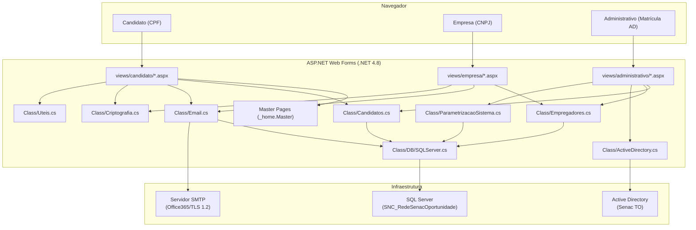

# Documentação Técnica — SNC_Carreiras
## Rede Senac de Oportunidades (Senac TO)

---

## Sumário

1. [Visao Geral](#visao-geral)
2. [Stack e Tecnologias](#stack-e-tecnologias)
3. [Estrutura de Diretorios](#estrutura-de-diretorios)
4. [Perfis de Usuario (Views)](#perfis-de-usuario-views)
   - 4.1 [Candidato](#candidato)
   - 4.2 [Empresa](#empresa)
   - 4.3 [Administrativo](#administrativo)
5. [Roteamento (URL Mappings)](#roteamento-url-mappings)
6. [Camada de Dados (Class)](#camada-de-dados-class)
   - 6.1 [Classes de Negocio](#classes-de-negocio)
   - 6.2 [Models](#models)
   - 6.3 [Infraestrutura de Banco](#infraestrutura-de-banco)
7. [Banco de Dados](#banco-de-dados)
8. [Autenticacao e Seguranca](#autenticacao-e-seguranca)
9. [Envio de E-mails](#envio-de-e-mails)
10. [Frontend (Assets)](#frontend-assets)
11. [Configuracoes do Sistema (Web.config)](#configuracoes-do-sistema-webconfig)
12. [Observabilidade e Logs](#observabilidade-e-logs)
13. [Diagrama de Arquitetura](#diagrama-de-arquitetura)

---

## Visao Geral

O **SNC_Carreiras** é uma plataforma web de intermediação de vagas de emprego operada pelo **Senac Tocantins**, denominada publicamente de **Rede Senac de Oportunidades**. O sistema conecta três tipos de usuários:

| Perfil | Identificação | Acesso |
|---|---|---|
| **Candidato** | CPF + Senha | `/v/c/...` |
| **Empresa** | CNPJ/CPF + Senha | `/v/e/...` |
| **Administrativo** | Matrícula + AD (Active Directory) | `/v/a/...` |

O sistema é responsável por:
- Cadastro e gerenciamento de candidatos e empresas.
- Publicação, gerenciamento e candidatura a vagas de emprego.
- Controle de etapas do processo seletivo.
- Envio de e-mails transacionais (confirmações, recuperação de senha, candidatura, encaminhamento).
- Gerenciamento administrativo de usuários internos via Active Directory.

---

## Stack e Tecnologias

### Back-end

| Tecnologia | Versão | Descrição |
|---|---|---|
| **ASP.NET Web Forms** | .NET Framework 4.8 | Framework principal da aplicação |
| **C#** | `langversion:default` (Roslyn via `Microsoft.CodeDom.Providers.DotNetCompilerPlatform 4.1.0`) | Linguagem de programação |
| **SQL Server** | SQL Server 2017 | Banco de dados relacional |
| **System.DirectoryServices** | — | Integração com Active Directory |
| **System.Net.Mail (SmtpClient)** | — | Envio de e-mails transacionais via SMTP/TLS 1.2 |
| **Serilog** | 3.1.1 | Log estruturado em arquivo |
| **iTextSharp** | 5.5.13.3 | Geração/manipulação de PDF |
| **Rijndael (AES-256)** | — | Criptografia simétrica de dados sensíveis |

### Front-end

| Tecnologia | Versão | Origem |
|---|---|---|
| **Bootstrap** | 4.x | Local (`App_Themes/plugins/bootstrap/`) |
| **jQuery** | 3.5.1 | CDN (ajax.googleapis.com) |
| **Font Awesome** | 5.13.0 | CDN (cdnjs.cloudflare.com) |
| **Bootstrap Datepicker** | 1.6.4 | CDN (cdnjs.cloudflare.com) |
| **Swiper** | Latest | CDN (cdn.jsdelivr.net) |
| **Google Fonts** | Roboto | CDN (fonts.googleapis.com) |
| **Material Icons** | — | CDN (fonts.googleapis.com) |
| **Google Tag Manager** | GTM-K9Z35MB | Rastreamento analítico |
| **Node Waves** | — | Local (`App_Themes/plugins/node-waves/`) |
| **Animate.css** | — | Local (`App_Themes/plugins/animate-css/`) |

### Configuracoes Gerais

| Parâmetro | Valor |
|---|---|
| **targetFramework** | 4.8 |
| **Culture / UICulture** | `pt-BR` |
| **Encoding** | UTF-8 |
| **Session Timeout** | 120 minutos |
| **ClientIDMode** | `Static` |
| **MachineKey Validation** | SHA1 |
| **MachineKey Decryption** | AES |

---

## Estrutura de Diretorios

```
SNC_Carreiras/
├── Class/                          # Camada de negócio e infraestrutura
│   ├── DB/                         # Acesso a dados
│   │   ├── Conexao.cs              # String de conexão SQL Server
│   │   ├── FuncoesSQL.cs           # Base de construção de connection strings
│   │   └── SQLServer.cs            # Wrapper ADO.NET para SQL Server
│   ├── Model/                      # Modelos de entidades (POCOs)
│   │   ├── MCandidato.cs
│   │   ├── MEmpresa.cs
│   │   ├── MVaga.cs
│   │   ├── MEmail.cs
│   │   ├── MParametrizacaoSistema.cs
│   │   └── (outros models...)
│   ├── ActiveDirectory.cs          # Autenticação de colaboradores via AD
│   ├── Candidatos.cs               # CRUD e queries de candidatos
│   ├── Empregadores.cs             # CRUD e queries de empresas
│   ├── Email.cs                    # Envio de e-mails transacionais
│   ├── Criptografia.cs             # Criptografia/descriptografia AES-256
│   ├── Uteis.cs                    # Utilitários (validações, máscaras, senhas)
│   ├── ParametrizacaoSistema.cs    # Parâmetros configuráveis do sistema
│   └── (outras classes de domínio...)
│
├── views/                          # Páginas ASPX por perfil
│   ├── candidato/                  # Área do candidato
│   ├── empresa/                    # Área da empresa
│   └── administrativo/             # Área administrativa (interna)
│
├── App_Themes/                     # Assets estáticos
│   ├── css/
│   │   ├── candidato/              # Estilos específicos do candidato
│   │   ├── empresa/                # Estilos específicos da empresa
│   │   └── style.css               # Estilo do painel administrativo
│   ├── plugins/
│   │   ├── bootstrap/
│   │   ├── node-waves/
│   │   └── animate-css/
│   └── images/                     # Logotipos, ícones, avatares, favicons
│
├── html/                           # Templates HTML de e-mail
│   ├── confirmacao-cadastro-candidato.html
│   ├── confirmacao-cadastro-empresa.html
│   ├── confirmacao-cadastro-empresa-pelo-admin.html
│   ├── esqueci-senha-candidato.html
│   ├── esqueci-senha-empresa.html
│   ├── redefinicao-senha-candidato.html
│   ├── redefinicao-senha-empresa.html
│   ├── candidatura-a-vaga.html
│   ├── avancar-etapa.html
│   └── encaminhamento.html
│
├── logs/                           # Arquivos de log gerados pelo Serilog
├── Web.config                      # Configuração principal da aplicação
└── login.aspx                      # Página de entrada padrão
```

---

## Perfis de Usuario (Views)

### Candidato

Localização: `views/candidato/`

| Arquivo | Rota Amigável | Descrição |
|---|---|---|
| `login.aspx` | `/v/c/login` | Login do candidato por CPF + Senha |
| `cadastro.aspx` | `/v/c/cadastro` | Pré-cadastro (CPF + e-mail), dispara e-mail de confirmação |
| `cadastro-completo.aspx` | `/v/c/cadastro-completo` | Preenchimento completo do perfil (etapas 1–N) |
| `home.aspx` | `/v/c/principal` | Dashboard do candidato com vagas sugeridas |
| `vagas.aspx` | `/v/c/vagas` | Listagem e busca de vagas disponíveis |
| `detalhe-vaga.aspx` | `/v/c/vaga` | Detalhe de vaga com opção de candidatura |
| `minhas-candidaturas.aspx` | `/v/c/minhas-candidaturas` | Histórico de candidaturas do candidato |
| `editar-cadastro.aspx` | `/v/c/editar-cadastro` | Edição do perfil/currículo |
| `alterar-senha.aspx` | `/v/c/alterar-senha` | Alteração de senha autenticada |
| `esqueci-senha.aspx` | `/v/c/esqueci-senha` | Recuperação de senha via e-mail |
| `redefinicao-senha.aspx` | `/v/c/redefinicao-senha` | Redefinição via link enviado por e-mail |
| `default.aspx` | — | Página padrão (vazia, usa Master Page) |
| `_home.Master` | — | Master Page da área logada do candidato |

**Master Page (`_home.Master`):**
- Sidebar de navegação com avatar e nome do candidato.
- Botão de upload/edição de foto de perfil.
- Toggle de disponibilidade para oportunidades.
- Links de menu: vagas, candidaturas, editar cadastro, alterar senha, sair.

**Sessão do Candidato:**

| Chave | Conteúdo |
|---|---|
| `Session["CPF"]` | CPF criptografado |
| `Session["CodCandidato"]` | Código do candidato criptografado |

---

### Empresa

Localização: `views/empresa/`

| Arquivo | Rota Amigável | Descrição |
|---|---|---|
| `login.aspx` | `/v/e/login` | Login da empresa por CNPJ + Senha |
| `cadastro.aspx` | `/v/e/cadastro` | Pré-cadastro da empresa |
| `cadastro-completo.aspx` | `/v/e/cadastro-completo` | Preenchimento completo do perfil da empresa |
| `home.aspx` | `/v/e/principal` | Dashboard da empresa |
| `vagas.aspx` | `/v/e/vagas` | Listagem das vagas da empresa |
| `criar-vaga.aspx` | `/v/e/criar-vaga` | Criação de nova vaga |
| `detalhe-vaga.aspx` | `/v/e/vaga` | Detalhe de vaga com gestão de candidatos |
| `editar-vaga.aspx` | `/v/e/editar-vaga` | Edição de vaga existente |
| `editar-cadastro.aspx` | `/v/e/editar-cadastro` | Edição do perfil da empresa |
| `alterar-senha.aspx` | `/v/e/alterar-senha` | Alteração de senha autenticada |
| `esqueci-senha.aspx` | `/v/e/esqueci-senha` | Recuperação de senha via e-mail |
| `redefinicao-senha.aspx` | `/v/e/redefinicao-senha` | Redefinição via link enviado por e-mail |

**Sessão da Empresa:**

| Chave | Conteúdo |
|---|---|
| `Session["CNPJ"]` | CNPJ criptografado |
| `Session["CodEmpresa"]` | Código da empresa criptografado |

---

### Administrativo

Localização: `views/administrativo/`

| Arquivo | Rota Amigável | Descrição |
|---|---|---|
| `login.aspx` | `/v/a/login` | Login via matrícula do colaborador (Active Directory) |
| `home.aspx` | `/v/a/principal` | Dashboard administrativo |
| `lista-candidatos.aspx` | `/v/a/candidatos` | Listagem de todos os candidatos com filtros |
| `detalhe-candidato.aspx` | `/v/a/candidato` | Detalhes completos do candidato |
| `editar-candidato.aspx` | `/v/a/editar-candidato` | Edição do cadastro do candidato pelo admin |
| `lista-empresas.aspx` | `/v/a/empresas` | Listagem de empresas (ativas e pendentes) |
| `detalhe-empresa.aspx` | `/v/a/empresa` | Detalhes da empresa |
| `criar-empresa.aspx` | `/v/a/criar-empresa` | Cadastro de empresa pelo administrador |
| `editar-empresa.aspx` | `/v/a/editar-empresa` | Edição de empresa pelo administrador |
| `lista-vagas.aspx` | `/v/a/vagas` | Listagem de todas as vagas |
| `detalhe-vaga.aspx` | `/v/a/vaga` | Detalhes da vaga com gestão de etapas e candidatos |
| `criar-vaga.aspx` | `/v/a/criar-vaga` | Criação de vaga pelo administrador |
| `editar-vaga.aspx` | `/v/a/editar-vaga` | Edição de vaga pelo administrador |
| `lista-usuarios.aspx` | `/v/a/usuarios` | Listagem de usuários administrativos |
| `detalhe-usuario.aspx` | `/v/a/usuario` | Detalhes do usuário administrativo |
| `criar-usuario.aspx` | `/v/a/criar-usuario` | Criação de usuário administrativo |
| `criar-aluno-mira.aspx` | `/v/a/criar-aluno-mira` | Cadastro de aluno do programa MIRA |
| `lista-beneficios.aspx` | `/v/a/beneficios` | Listagem de benefícios cadastrados |
| `detalhe-beneficio.aspx` | `/v/a/beneficio` | Detalhe de benefício |
| `criar-beneficio.aspx` | `/v/a/criar-beneficio` | Criação de novo benefício |
| `lista-areas-interesse.aspx` | `/v/a/areas-interesse` | Listagem de áreas de interesse |
| `detalhe-area-interesse.aspx` | `/v/a/area-interesse` | Detalhe de área de interesse |
| `criar-area-interesse.aspx` | `/v/a/criar-area-interesse` | Criação de área de interesse |
| `lista-configuracoes.aspx` | `/v/a/parametrizacoes` | Listagem das parametrizações do sistema |
| `detalhe-configuracao.aspx` | `/v/a/parametrizacao` | Detalhe e edição de parametrização |
| `detalhe-email.aspx` | `/v/a/email-configuracao` | Configuração do servidor de e-mail |

---

## Roteamento (URL Mappings)

O sistema utiliza o mecanismo nativo de `<urlMappings>` do ASP.NET (definido em `Web.config`) para mapear rotas amigáveis às páginas físicas `.aspx`.

**Padrão de rotas:**

| Prefixo | Perfil |
|---|---|
| `/v/a/` | Administrativo |
| `/v/c/` | Candidato |
| `/v/e/` | Empresa |

**Atalhos diretos:**

| URL | Destino |
|---|---|
| `/candidato` | Login do candidato |
| `/empresa` | Login da empresa |
| `/administrativo` | Login administrativo |
| `/login` | `login.aspx` raiz |

---

## Camada de Dados (Class)

### Classes de Negocio

Todas as classes utilizam diretamente a classe `SQLServer` (ADO.NET) para execução de queries parametrizadas.

#### `Candidatos.cs`

- **Namespace:** `SNC_Carreiras.Class`
- **Responsabilidade:** Todas as operações CRUD relacionadas a candidatos.
- **Principais funcionalidades:**
  - Consulta por CPF, código, filtros avançados (escolaridade, gênero, PcD, faixa etária, habilitação, área).
  - Cadastro prévio e cadastro completo (multi-etapas).
  - Atualização de dados pessoais, endereço, objetivo profissional.
  - Gestão de status (ativo, inativo, pendente).
  - Controle de disponibilidade para oportunidades.
  - Atualização do último acesso.

#### `Empregadores.cs`

- **Namespace:** `SNC_Carreiras.Class`
- **Responsabilidade:** Operações CRUD de empresas empregadoras.
- **Principais funcionalidades:**
  - Cadastro por CNPJ/CPF, aprovação e desativação pelo setor de empregabilidade.
  - Consulta por CNPJ, código, status.
  - Atualização em múltiplas etapas (razão social, CNAE, segmento, endereço, responsável legal).
  - Cadastro direto pelo administrador com envio de senha aleatória.

#### `Email.cs`

- **Namespace:** `SNC_Carreiras.Class`
- **Responsabilidade:** Envio de e-mails transacionais via `System.Net.Mail.SmtpClient` com TLS 1.2.
- Configuração armazenada na tabela `TB_EmailEMA` (host, porta, usuário, senha criptografada).
- Templates HTML carregados de `~/html/*.html` com substituição de placeholders e inline do logotipo (base64 com cache em memória).
- **Tipos de e-mail:**
  - Confirmação de cadastro (candidato / empresa / empresa pelo admin).
  - Recuperação de senha (candidato / empresa).
  - Confirmação de alteração de senha (candidato / empresa).
  - Confirmação de candidatura a vaga.
  - Avanço de etapa no processo seletivo.
  - Encaminhamento de candidatura.

#### `Criptografia.cs`

- **Namespace:** `SNC_Carreiras.Class`
- **Responsabilidade:** Criptografia e descriptografia de dados sensíveis.
- **Algoritmo:** Rijndael (AES-256-CBC) com chave de 256 bits e IV fixo.
- **Uso:** Dados de sessão (`CPF`, `CNPJ`, `CodCandidato`, `CodEmpresa`), links de redefinição de senha enviados por e-mail, senhas armazenadas no banco.

#### `Uteis.cs`

- **Namespace:** `SNC_Carreiras.Class`
- **Responsabilidade:** Funções utilitárias transversais.
- **Funcionalidades:**
  - `VerificaCurriculoCandidatoPreenchido`: Valida se o currículo do candidato está apto para candidatura.
  - `VerificaContatosCandidatoParaCandidatura`: Garante que o candidato possui ao menos 2 contatos cadastrados.
  - `MascaraEmail`: Aplica máscara parcial em e-mails para exibição.
  - `ValidarSenha`: Valida força da senha (mínimo 8 caracteres, letras, números e caractere especial).
  - `ValidaEmail`: Validação por Regex.
  - `GeraSenhaAleatoria`: Geração de senha aleatória de 10 caracteres.
  - `FormatarCPF`: Formata string de CPF com máscara.

#### `ActiveDirectory.cs`

- **Namespace:** `SNC_Carreiras.Class`
- **Responsabilidade:** Autenticação e consulta de usuários no Active Directory do Senac.
- **Métodos:**
  - `LoginUsuarioAD`: Valida credenciais via `PrincipalContext`.
  - `ObterDadosUsuarioLogado`: Recupera o `displayName` do usuário via `DirectorySearcher`.

#### `ParametrizacaoSistema.cs`

- **Namespace:** `SNC_Carreiras.Class`
- **Responsabilidade:** Gerenciamento de parâmetros configuráveis do sistema.
- **Tabelas:** `TB_ParametrizacoesSistemaPAS` + `TB_TiposParametrizacaoTIP`.
- **Parâmetros disponíveis:**
  - `AreaInteresse / QuantidadeMaxima`: Limite de áreas de interesse por candidato (padrão: 3).

---

### Models

Localização: `Class/Model/`

| Model | Entidade |
|---|---|
| `MCandidato` | Candidato (dados pessoais, endereço, contatos, disponibilidade, status) |
| `MEmpresa` | Empresa empregadora (razão social, CNPJ, segmento, endereço, status) |
| `MVaga` | Vaga de emprego |
| `MEmail` | Configuração de e-mail (host SMTP, porta, credenciais) |
| `MParametrizacaoSistema` | Parâmetro configurável do sistema |
| `MContatoCandidato` | Contato do candidato (e-mail, telefone, WhatsApp) |
| `MEscolaridadeCandidato` | Escolaridade do candidato |
| `MExperienciaProfissional` | Experiência profissional do candidato |
| `MAreaInteresse` | Área de interesse (domínio) |
| `MAreaInteresseCandidato` | Áreas de interesse vinculadas ao candidato |
| `MDeficiencia` | Tipo de deficiência (domínio) |
| `MDeficienciaCandidato` | Deficiências vinculadas ao candidato |

---

### Infraestrutura de Banco

#### `Conexao.cs`

- Define as credenciais de acesso ao SQL Server via objeto estático `CamposConexaoSQL`.
- **Banco de dados:** `SNC_RedeSenacOportunidade`
- **Servidor:** `192.168.0.81` (rede interna)
- **Usuário:** `usr_Carreiras`

#### `FuncoesSQL.cs`

- Classe base que constrói a `ConnectionString` a partir do objeto `CamposConexaoSQL` usando `DbProviderFactories`.

#### `SQLServer.cs`

- Wrapper sobre `SqlConnection` e `SqlCommand` (ADO.NET).
- **Métodos principais:** `PrepareQuery`, `AddParameter`, `GetDataTable`, `GetDataset`, `ExecuteNonQuery`, `TestConnection`.
- Não utiliza ORM; todas as queries são SQL inline parametrizado.

---

## Banco de Dados

- **SGBD:** Microsoft SQL Server
- **Banco principal:** `SNC_RedeSenacOportunidade`

### Principais Tabelas

| Tabela | Descrição |
|---|---|
| `TB_CandidatosCAN` | Candidatos da plataforma |
| `TB_ContatosCandidatosCCA` | Contatos dos candidatos (e-mail, telefone, WhatsApp) |
| `TB_EnderecoEND` | Endereços |
| `TB_FotosCandidatosFOC` | Fotos dos candidatos |
| `TB_EscolaridadesCandidatosESC` | Escolaridades dos candidatos |
| `TB_AreasInteresseCandidatosACA` | Áreas de interesse dos candidatos |
| `TB_DeficienciasCandidatosDFC` | Deficiências dos candidatos |
| `TB_EmpresasEMP` | Empresas empregadoras |
| `TB_ContatosEmpresasCEM` | Contatos das empresas |
| `TB_EmailEMA` | Configuração do servidor SMTP |
| `TB_ParametrizacoesSistemaPAS` | Parâmetros configuráveis do sistema |
| `TB_TiposParametrizacaoTIP` | Tipos de parametrização |
| `TB_StatusSTA` | Domínio de status genérico |
| `TB_GenerosGEN` | Domínio de gêneros |
| `TB_EstadosCivisETC` | Domínio de estados civis |
| `TB_CategoriasHabilitacaoCAT` | Domínio de categorias de CNH |
| `TB_SegmentosAtuacaoSEG` | Domínio de segmentos de atuação |
| `TB_AlunosMira` | Alunos do programa MIRA |

> **Convenção de nomenclatura de colunas:**
> `TXT_` = texto | `COD_` = código/FK | `DAT_` = data | `PK_COD_` = chave primária | `BOO_` = booleano | `NUM_` = número | `FK_COD_` = chave estrangeira explícita

---

## Autenticacao e Seguranca

### Candidato e Empresa

- Autenticação por credenciais próprias (CPF/CNPJ + senha).
- Senhas armazenadas no banco com criptografia AES-256 (`Criptografia.Encrypt`).
- Sessão mantida por chaves criptografadas (`CPF`, `CNPJ`, `CodCandidato`, `CodEmpresa`).
- Links de redefinição de senha gerados com parâmetros criptografados na URL.
- Validação de força de senha: mínimo 8 caracteres, letras, números e caractere especial.

### Administrativo

- Autenticação integrada ao **Active Directory (AD)** via `System.DirectoryServices.AccountManagement`.
- Validação de credenciais via `PrincipalContext.ValidateCredentials`.
- Busca de dados do usuário via `DirectorySearcher` com filtro `sAMAccountName`.

### Configuracoes de Seguranca (Web.config)

- `machineKey`: SHA1 (validação) + AES (descriptografia).
- `sessionState`: timeout 120 min, `cookieless="AutoDetect"`.
- `customErrors mode="Off"` (desabilitado no branch atual).

---

## Envio de E-mails

- **Biblioteca:** `System.Net.Mail.SmtpClient`
- **Protocolo:** SMTP com SSL/TLS 1.2
- **Configuração:** Armazenada no banco de dados (`TB_EmailEMA`), editável pelo painel administrativo (`/v/a/email-configuracao`).
- **Templates:** HTML externos em `~/html/`, carregados com `StreamReader` e injeção do logotipo em base64 (cache em memória).
- **Logs de erros:** Gravados via Serilog em `~/logs/log-email.txt`.

### Fluxos de E-mail

| Evento | Template | Destinatário |
|---|---|---|
| Pré-cadastro de candidato | `confirmacao-cadastro-candidato.html` | Candidato |
| Pré-cadastro de empresa | `confirmacao-cadastro-empresa.html` | Empresa |
| Cadastro de empresa pelo admin | `confirmacao-cadastro-empresa-pelo-admin.html` | Empresa |
| Recuperação de senha (candidato) | `esqueci-senha-candidato.html` | Candidato |
| Recuperação de senha (empresa) | `esqueci-senha-empresa.html` | Empresa |
| Alteração de senha (candidato) | `redefinicao-senha-candidato.html` | Candidato |
| Alteração de senha (empresa) | `redefinicao-senha-empresa.html` | Empresa |
| Candidatura a vaga | `candidatura-a-vaga.html` | Candidato |
| Avanço de etapa | `avancar-etapa.html` | Candidato |
| Encaminhamento | `encaminhamento.html` | Candidato |

---

## Frontend (Assets)

### Estrutura de CSS

```
App_Themes/css/
├── candidato/
│   ├── candidato-auth.css      # Login, cadastro, recuperação de senha
│   └── candidato.css           # Dashboard e demais páginas do candidato
├── empresa/
│   └── empresa-auth.css        # Login, cadastro da empresa
└── style.css                   # Painel administrativo
```

### Bibliotecas Locais

```
App_Themes/plugins/
├── bootstrap/css/bootstrap.css
├── node-waves/waves.css
└── animate-css/animate.css
```

### Recursos de Imagem

```
App_Themes/images/
├── logo_rede_senac_de_oportunidades_semfundo.png
├── no-avatar.svg
├── binoculars.svg
├── minhas-candidaturas.svg
├── atualizar-cadastro.svg
└── Favicon/
    ├── favicon-32x32.png
    ├── favicon-16x16.png
    └── apple-touch-icon.png
```

---

## Configuracoes do Sistema (Web.config)

| Configuração | Valor |
|---|---|
| `compilation debug` | `true` |
| `targetFramework` | `4.8` |
| `httpRuntime targetFramework` | `4.8` |
| `culture` | `pt-BR` |
| `uiCulture` | `pt-BR` |
| `fileEncoding` | `utf-8` |
| `sessionState timeout` | `120` minutos |
| `sessionState cookieless` | `AutoDetect` |
| `customErrors mode` | `Off` |
| `clientIDMode` | `Static` |
| `System.Runtime.CompilerServices.Unsafe` | Redirect para versão `6.0.0.0` |
| **Compiler** | `Microsoft.CodeDom.Providers.DotNetCompilerPlatform 4.1.0` (Roslyn) |

---

## Observabilidade e Logs

- **Biblioteca:** Serilog
- **Formato:** `{Timestamp:yyyy-MM-dd HH:mm:ss.fff zzz} [{Level:u3}] {Message:lj}{NewLine}{Exception}`
- **Estratégia:** Um arquivo por contexto de erro, armazenados em `~/logs/`.
- Exemplos de arquivos de log gerados:

| Arquivo | Contexto |
|---|---|
| `logs/candidato-alterar-senha.txt` | Erros na página de alteração de senha do candidato |
| `logs/empresa-alterar-senha.txt` | Erros na página de alteração de senha da empresa |
| `logs/log-email.txt` | Erros no envio de e-mails transacionais |

> **Observação:** O logger é instanciado e encerrado por chamada (`Log.CloseAndFlush()`), sem injeção de dependência centralizada.

---

## Diagrama de Arquitetura



